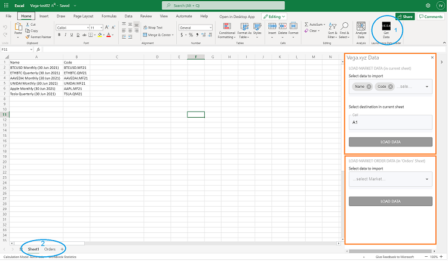

# vega.xyz excel addin prototype
Excel add-in prototype that loads data from vega.xyz REST API.

## Introduction
The Add-in prototype implements a user-friendly way to load vega.xyz data into Excel. As this is a __protoype__, two arbitrary use cases are covered that illustrate different functional solutions.

## Introduction for Use

### Use case 1 – Load data into a cell range in current worksheet with dynamic attribute selection
Loads Market data with a dynamic selection of attributes (hardcoded subset of all attributes) - refers to upper orange rectangle in screenshot. 

1. Click the dropdown list to select/deselect attributes or type to search for an attribute.

2. Click LOAD DATA button writes the dataset into the current sheet (see 2 in screenshot), the range starts as defined in destination cell input field. Every time the LOAD DATA button is clicked the result dataset is (over)written into current sheet.

### Use case 2 – Load data into table in a separate worksheet
Loads Market Order data with a limited predefined selection of attributes - refers to lower orange rectangle in screenshot.
1. Click the Market dropdown list to select one or more markets or type to search for a market.

2. Every time the LOAD DATA button is clicked the result dataset is displayed as an Excel table into sheet Orders (see image: blue circle 2); the Orders sheet is created if non-existent and cleaned every time data is (re)loaded.

## Set up your development environment (Visual Studio Code)
This project was build with Node.js and Visual Studio Code, to set up your development environment follow the instructions here 
https://docs.microsoft.com/en-us/office/dev/add-ins/overview/set-up-your-dev-environment

## Run on local web server
- Check out the repository.
- In VS Code open the project, then open a terminal to install packages:  

        npm install

- To run on local web server:    

        npm start

Excel is launched.

- To launch the add-in click the “Vega Get Data” in the ribbon (see screenshot: blue circle 1 ).

